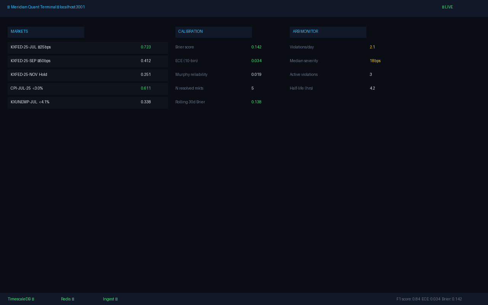

# Meridian

A prediction-market research engine. Ingests live order-book data from Kalshi
(primary) and Polymarket, extracts implied probabilities, scores
their calibration against realized outcomes, detects no-arbitrage violations
across related markets, and surfaces microstructure signals — over a
streaming event-driven pipeline.

**This is a research platform, not a trading bot.** The system reads exchange
data and computes derived signals. It does not place orders or move money.

---

## Status

**Phases 0–12 are complete.** One-command setup: `make setup`. See [`COMPLETION.md`](COMPLETION.md) and [`AGENT-LOOP.md`](AGENT-LOOP.md) for agent verification.

| Phase | Scope | Status |
|---|---|---|
| 0 | Foundations: repo skeleton, Docker stack, CI, healthcheck | ✓ Done |
| 1a | Canonical event schema + SQL migrations | ✓ Done |
| 1b | Kalshi REST client + RSA-PSS auth | ✓ Done |
| 1c | Kalshi WebSocket ingestion worker | ✓ Done |
| 1d | Polymarket ingestion + Prometheus/Grafana observability | ✓ Done |
| 2 | Implied probability + calibration engine | ✓ Done |
| 3 | Cross-market no-arb consistency engine | ✓ Done |
| 4 | Microstructure analytics + execution simulator | ✓ Done |
| 5 | Implied Fed-rate distribution + event-response model | ✓ Done |
| 6 | Research framework + portfolio optimizer | ✓ Done |
| 7 | Quant Terminal frontend + production polish | ✓ Done |
| 8–10 | Anomaly, regime, market maker, NLP (stretch) | ✓ Done |
| 11 | Polish: ECE, arb stats, home page, research report | ✓ Done |
| 12 | Live calibration sync, event study, one-command setup | ✓ Done |

Full narrative: [docs/roadmap.md](docs/roadmap.md) · [ROADMAP.md](ROADMAP.md)

---

## Demo

**Local:** after `make setup` — [http://localhost:3001](http://localhost:3001) (home) · [markets](http://localhost:3001/markets) · [calibration](http://localhost:3001/calibration) · [arb](http://localhost:3001/arb) · [fedwatch](http://localhost:3001/fedwatch)

**Research:** [`docs/research/fed-calibration-report.md`](docs/research/fed-calibration-report.md) · [`docs/meridian-brief.md`](docs/meridian-brief.md)



---

## Quick start (one command)

Prerequisites: **Docker** (Compose v2), **Python 3.12**, **[uv](https://docs.astral.sh/uv/)**,
**Node.js 20+**, and a **Kalshi API key** for live ingest
([docs/getting-started.md](docs/getting-started.md) §6).

```sh
git clone https://github.com/RalfiBahar/meridian
cd meridian
cp .env.example .env             # add MERIDIAN_KALSHI_ACCESS_KEY + PEM path
make setup                       # deps → discover popular markets → full stack
```

`make setup` (or `bash scripts/setup.sh`) will:

1. Install Python (`uv sync`) and frontend (`npm install`) dependencies
2. **Auto-discover** high-volume Kalshi + Polymarket markets for live ingest
3. Boot Docker (DB, Redis, ingest, Grafana), run migrations + analytics pipeline
4. Start the API (`:8000`) and Quant Terminal frontend (`:3001`)

Open [http://localhost:3001/markets](http://localhost:3001/markets) when done.

To refresh ingest subscriptions later:

```sh
uv run python -m meridian.cli markets discover
docker compose up -d --build ingest-kalshi ingest-polymarket
```

---

## Quick start (manual / step-by-step)

See [`COMPLETION.md`](COMPLETION.md) for Phase 12 goals and [`AGENT-LOOP.md`](AGENT-LOOP.md) to start the agent loop.

For a complete first-run walkthrough including credential setup, see
[docs/getting-started.md](docs/getting-started.md).

---

## What works today

```sh
# 1. System healthcheck (Postgres + TimescaleDB + Redis)
make health

# 2. Apply schema migrations idempotently
make migrate

# 3. Verify Kalshi auth handshake against production
uv run python -m meridian.cli kalshi status

# 4. List real markets from Kalshi
uv run python -m meridian.cli kalshi markets --limit 5 --status open

# 5. Pull a real L2 order book (Fed funds futures contract)
uv run python -m meridian.cli kalshi orderbook KXFED-26JUN-T3.75

# 6. Run the full test suite (34 tests, unit + live-DB integration)
make test-all

# 7. Strict type-check (28 source files)
make typecheck

# 8. Lint + format check
make lint
```

Each command and its sample output is documented in
[docs/cli-reference.md](docs/cli-reference.md).

---

## Architecture at a glance

```
                       ┌──────────────────────────────────────┐
                       │   Quant Terminal (Next.js — Phase 7) │
                       └────────────────▲─────────────────────┘
                                        │ WebSocket / REST
                       ┌────────────────┴─────────────────────┐
                       │      API Gateway (Phase 7)           │
                       └──┬──────────┬──────────┬──────────┬──┘
                          │          │          │          │
                ┌─────────▼──┐  ┌────▼─────┐ ┌──▼─────┐ ┌──▼────────────┐
                │ Analytics  │  │ Calibrn  │ │ Arb    │ │ Research /    │
                │ (Phase 2)  │  │ (Phase 2)│ │(Phase 3│ │ Backtester    │
                └──────┬─────┘  └────┬─────┘ └──┬─────┘ │ (Phase 6)     │
                       │             │          │       └────────┬──────┘
                       └──────┬──────┴──────────┴───────┬────────┘
                              │                        │
                       ┌──────▼─────────┐      ┌───────▼────────┐
                       │  TimescaleDB   │      │   Postgres     │
                       │  ticks         │      │  markets       │
                       │  book_snapshots│      │  market_groups │
                       │  signals       │      │  news_events   │
                       └──────▲─────────┘      └───────▲────────┘
                              │                        │
                              │      Redis Streams (event bus, Phase 1c)
                              │
                ┌─────────────┴────────────────────────────────────┐
                │     Ingestion Workers   ← currently being built  │
                │   - Kalshi WS + REST   (Phase 1c)                │
                │   - Polymarket CLOB    (Phase 1d)                │
                │   normalize → write    (idempotent, gap-aware)   │
                └─────▲─────────────────▲────────────────▲─────────┘
                      │                 │                │
                  Kalshi WS         Polymarket       News/macro
                  + REST            CLOB API         feeds
```

Detailed component descriptions: [docs/architecture.md](docs/architecture.md).

---

## Project structure

```
meridian/
├── docs/                        # All documentation lives here
│   ├── README.md                #   docs index
│   ├── getting-started.md       #   first-time setup walkthrough
│   ├── cli-reference.md         #   every command, with sample output
│   ├── architecture.md          #   system design + db schema
│   ├── kalshi.md                #   Kalshi API details + quirks
│   ├── concepts.md              #   financial concepts implemented
│   └── roadmap.md               #   8-phase plan with status
├── migrations/                  # Forward-only numbered SQL migrations
│   └── 0001_initial_schema.sql
├── src/meridian/
│   ├── config.py                # pydantic-settings (env-driven config)
│   ├── logging.py               # structlog: console in dev, JSON in prod
│   ├── events.py                # canonical CanonicalEvent + payload union
│   ├── db/
│   │   ├── postgres.py          # asyncpg pool factory + context manager
│   │   └── migrate.py           # forward-only migration runner
│   ├── bus/
│   │   └── redis.py             # async Redis client factory
│   ├── kalshi/
│   │   ├── auth.py              # KalshiSigner: RSA-PSS signing
│   │   ├── client.py            # KalshiClient: async REST wrapper
│   │   ├── endpoints.py         # env-routed REST + WS URLs
│   │   ├── models.py            # KalshiMarket, KalshiOrderbook, ...
│   │   └── errors.py            # KalshiError hierarchy
│   └── cli/                     # `python -m meridian.cli ...`
│       ├── __main__.py          # click group + command registration
│       ├── health.py            #   `health`
│       ├── migrate.py           #   `migrate`
│       └── kalshi.py            #   `kalshi {status,markets,orderbook}`
├── tests/                       # 34 tests (6 files; unit + integration)
├── docker/timescale/init.sql    # Enables timescaledb extension on first boot
├── docker-compose.yml           # TimescaleDB + Redis with healthchecks
├── Makefile                     # All developer commands
├── pyproject.toml               # uv-managed deps + tool config
└── .env.example                 # Documented config knobs
```

---

## Commands cheat sheet

```
make help            # show this list
make install         # sync dependencies via uv
make up              # boot postgres+timescale and redis (with --wait)
make down            # stop containers (preserves volumes)
make reset           # stop containers and DELETE volumes (full wipe)
make logs            # tail container logs
make ps              # show container status
make health          # run the healthcheck CLI
make migrate         # apply pending DB migrations
make test            # run unit tests only
make test-all        # run unit + integration tests (requires `make up`)
make lint            # ruff check
make format          # ruff format (modifies files)
make typecheck       # mypy strict
make check           # lint + typecheck + tests, all in one
```

Full descriptions and sample output for each command are in
[docs/cli-reference.md](docs/cli-reference.md).

---

## The `meridian` CLI

```
python -m meridian.cli health                          # systems healthcheck
python -m meridian.cli migrate                         # apply DB migrations
python -m meridian.cli kalshi status                   # auth + exchange status
python -m meridian.cli kalshi markets [--limit N] [--status open]
python -m meridian.cli kalshi orderbook <ticker>
```

See [docs/cli-reference.md](docs/cli-reference.md) for arguments, options, and
sample output.

---

## Tech stack

| Layer | Choice | Why |
|---|---|---|
| Language | Python 3.12 (asyncio + uvloop) | Strong async ecosystem; type-checkable |
| Web | FastAPI (Phase 7) | Pydantic models double as schemas |
| Database | TimescaleDB (Postgres extension) | One DB for OLTP + time-series |
| Event bus | Redis Streams (Phase 1c+) | Persistent, consumer groups, one binary |
| HTTP | httpx (async) | Modern, typed, swappable transports |
| Crypto | `cryptography` | RSA-PSS for Kalshi auth |
| Logging | structlog | JSON in prod, console in dev |
| Config | pydantic-settings | Same library used for runtime data |
| Tests | pytest + pytest-asyncio | Unit + integration markers |
| Lint | ruff (lint+format) | Fast, replaces flake8/black/isort |
| Types | mypy strict | Catches numerical bugs early |
| Package mgmt | uv | Fast resolver, modern lockfile |

The rationale for each choice is unpacked in [docs/architecture.md](docs/architecture.md).

---

## Repository

- GitHub: <https://github.com/RalfiBahar/meridian> (private)
- CI: GitHub Actions runs on every push — three parallel jobs
  (lint+typecheck, unit tests, integration smoke against a live Compose stack).
